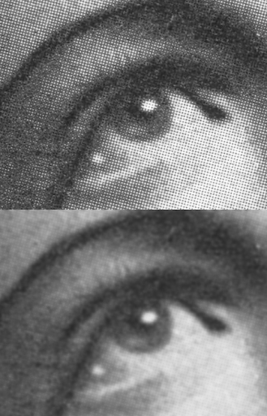

[](https://gitlab.com/liveeo/liveeo-python-cookiecutter)
[](https://github.com/python/black)

# Unsupervised classification using k-means
The goal of this project is to use unsupervised machine learning, specifically k-means clustering, and zonal statistics to identify and isolate ground-related pixels in an image. The k-means algorithm will be used to group similar pixels into clusters, and zonal statistics will be applied to each cluster to extract statistical information about the pixels in that cluster.
<br> 
<!-- START doctoc generated TOC please keep comment here to allow auto update -->
<!-- DON'T EDIT THIS SECTION, INSTEAD RE-RUN doctoc TO UPDATE -->

- [Description](#description)
  - [Idea](#idea)
- [Theoretical framework](#theoretical-framework)
  - [Gaussian Blurring](#gaussian-blurring)
  - [Gabor filtering](#gabor-filtering)
  - [Vegetation Indices](#vegetation-indices)
  - [PCA](#pca)
  - [K-means clustering](#k-means-clustering)
  - [Zonal statistics](#zonal-statistics)
- [Installation](#installation)
- [Running example](#running-example)
- [CHANGELOG](#changelog)
- [Contact](#contact)

<!-- END doctoc generated TOC please keep comment here to allow auto update -->

----
## Description

### Idea
The main idea behind the proposed pipeline is to address the issue of noise and large data size in satellite images by applying smoothing and dimensionality reduction techniques. K-means clustering is then utilized as an unsupervised method to group the pixels into distinct categories.

----
## Theoretical framework

### Gaussian Blurring
Gaussian blurring is a technique for smoothing an image by blurring it with a Gaussian function. When applied to an image, it has the effect of smoothing out high-frequency details and reducing noise. Gaussian blurring is often used as a preprocessing step for image analysis and computer vision tasks, as it can help to reduce the amount of noise and clutter in the image and make it easier to detect features of interest.



### Gabor filtering
Gabor filtering is a technique for extracting texture and orientation information from an image. It involves convolving the image with a Gabor filter, which is a sinusoidal waveform modulated by a Gaussian envelope.


### Vegetation Indices
NDVI: The Normalized Difference Vegetation Index is a widely used remote sensing index that measures the amount of vegetation cover in an area. It is calculated by taking the difference between the near-infrared (NIR) and red bands of a satellite or aerial image, and then normalizing that difference by dividing it by the sum of the NIR and red bands

OSAVI: The Optimized Soil Adjusted Vegetation Index (OSAVI) is a vegetation index that was developed to improve the performance of the Soil Adjusted Vegetation Index (SAVI) in areas with low to moderate greenness and high soil brightness. OSAVI is often used to estimate the biomass and canopy cover of vegetation, as well as to monitor the productivity and health of crops.

SAVI: The Soil Adjusted Vegetation Index (SAVI) is a vegetation index used to assess the greenness of vegetation and its density. It is calculated by adjusting the Normalized Difference Vegetation Index (NDVI) to account for the soil background present in the image. 


### PCA
Principal component analysis or PCA is a method used to reduce the dimensionality of a data set by transforming it to a new set of linearly uncorrelated variables called principal components (PCs). PCA is often used to visualize high-dimensional data, identify patterns in data, and to reduce the complexity of machine learning algorithms.


### K-means clustering
K-means is an unsupervised machine learning algorithm for clustering data into k groups (also known as clusters) based on their features.K-means is often used for image segmentation, clustering data points in a dataset, or finding patterns in data.


### Zonal statistics
Zonal statistics are statistical measurements of the values of a set of raster data within defined regions, or "zones". These measurements can be used to summarize and analyze the values of the raster data within each zone. Zonal statistics can be calculated for various statistical measures, such as mean, median, minimum, maximum, standard deviation, and more. These statistics can be useful for understanding and comparing the spatial patterns and characteristics of the data within different zones.


## Installation

Pre-requirements:
- pip
- anaconda (or another virtual environment)

It is recommended to use the provided environment.yml which is in the folder:
```bash
conda env create -f environment.yml
```

## How to run

Scripts:
-kmeans_zonal.py: To process a specific image using k-means, you can modify lines 304 and 305 with the desired folder and image file path. The image file should be in TIFF format and should have multiple channels, including red, green, blue, and near-infrared channels in that order. This is necessary for the correct calculation of vegetation indices. Keep in mind that any satellite image can be used, but the above channel format is required for accurate results.Also make sure to modify line 346 as it is related to the output path.

-check_common_classes.py: To compare the common classes between two k-means outputs, you can use the check_common_classes.py script. To run this script, use the command python check_common_classes.py -h for help. To find the common classes, use the command python check_common_classes.py common followed by the file paths for the two CSV files containing the zonal statistics. For example: python check_common_classes.py common --path-to-csv1 "place_1st_csv_here.csv" --path-to-csv2 "place_2nd_csv_here.csv"

## CHANGELOG

See [CHANGELOG.md](CHANGELOG.md)

----

## Contact
Antonios Koutroumpas: [antonios.koutroumpas@live-eo.com](mailto:antonios.koutroumpas@live-eo.com)
